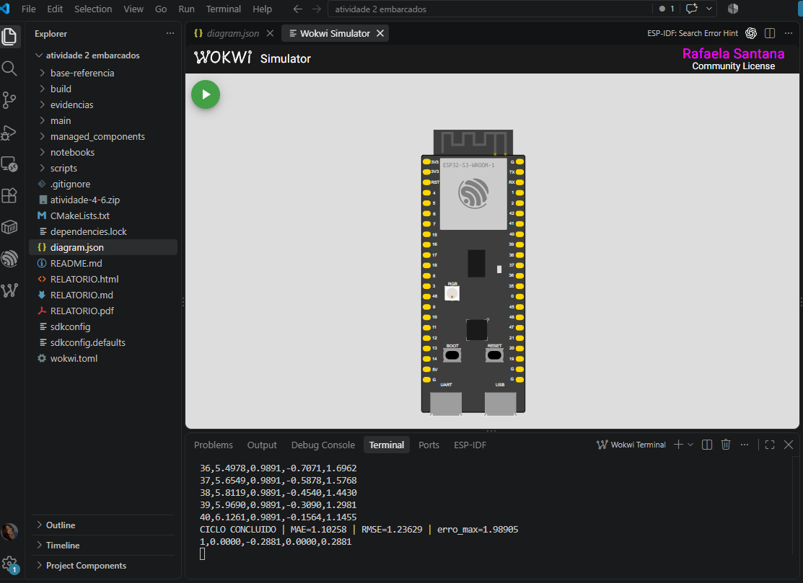

# Atividade prática 4/6 — Hello World com avaliação de erro

**Estudante:** Rafaela Santana  
**Disciplina:** IA embarcada e modelos compactos


## Reprodução

1. Abra esta pasta no VS Code com as extensões ESP-IDF e Wokwi Simulator.
2. Abra um terminal com o ambiente ESP-IDF ativado. Nesta máquina, no PowerShell:

   ```powershell
   . C:\Espressif\tools\Microsoft.v6.1.PowerShell_profile.ps1
   $env:PYTHONUTF8 = '1'
   idf.py set-target esp32s3
   idf.py build
   ```

3. O modelo treinado já está em `main/model.cc`. Para regenerar esse arquivo a partir do artefato do notebook, opcionalmente execute antes do build:

   ```powershell
   python scripts/converter_modelo.py notebooks/hello_world_int8.tflite main/model.cc
   ```

   O script mantém os símbolos `g_model` e `g_model_len`, esperados pelo firmware. Um `xxd -i` sem adaptação costuma produzir nomes diferentes. Não é necessário retreinar para reproduzir a inferência. O notebook de treinamento encontra-se em `notebooks/`.

4. Pressione `Ctrl+Shift+P` e execute **Wokwi: Start Simulator**. Caso a extensão solicite uma licença, ative sua própria licença pela interface do Wokwi.
5. Observe a identificação `HELLO WORLD`, as linhas `amostra,x_rad,y_rede,y_seno,erro_absoluto` e, a cada 40 amostras, `CICLO CONCLUIDO`. Um ciclo leva aproximadamente 10 segundos de tempo simulado, mais o custo das inferências e da saída serial.
6. Capture a janela do Wokwi mostrando a placa e os resultados do monitor serial. A imagem deve ser da execução deste projeto.

`wokwi.toml` usa `build/flasher_args.json`, que inclui os endereços do bootloader, da tabela de partições e da aplicação, e `build/hello_world.elf` para os símbolos.

## Funcionamento

40 amostras por ciclo, intervalo de 250 ms, quantizacao int8 e calculo de MAE, RMSE e erro maximo. Arena de 4.096 bytes.

## Arquivos para consulta

- `RELATORIO.pdf`: relatório breve da atividade.
- `main/main_functions.cc`: carregamento, validação, quantização e inferência.
- `main/output_handler.cc`: comparação e métricas por ciclo.
- `evidencias/`: registros de validação e captura da simulação, quando disponível.

## Escopo do ponto extra

Esta versão trata da parte obrigatória. Não implementa outro sensor nem um novo dataset e não reivindica o ponto extra. Trocar mensagens, aumentar amostras ou avaliar o mesmo modelo não equivale a retreinamento.

## Validação realizada

Compilação concluída com ESP-IDF 6.1.0, esp-tflite-micro 1.3.5 e esp-nn 1.4.1. Firmware gerado em `build/`. Captura da execucao no Wokwi apresentada abaixo.

## Print da simulacao no Wokwi



Captura fornecida por Rafaela Santana, com a placa ESP32-S3 e a saida do programa no terminal. O ciclo exibido registrou **MAE = 1,10258**, **RMSE = 1,23629** e **erro maximo = 1,98905**. Esses valores documentam a execucao, mas indicam erro elevado na aproximacao do seno.
